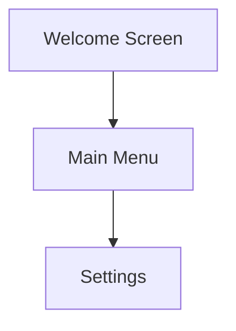

# Cogbase - AI Chatbot Platform

A comprehensive dashboard for building, managing, and analyzing AI chatbots with advanced features including RAG training and visual UI flow building.

## Features

### 🤖 Agent Management
- Create and configure AI agents with custom system prompts
- Support for multiple LLM models (GPT-4, GPT-3.5, etc.)
- Adjustable temperature and token limits
- Conversation starters and constraints
- Training status tracking

### 📚 RAG Training System
Train your chatbots with custom knowledge bases using Retrieval-Augmented Generation (RAG):

- **Document Upload**: Support for `.txt`, `.md`, `.pdf`, and `.csv` files (up to 10MB)
- **Smart Chunking**: Configurable chunk sizes (128-2048 characters) with overlap
- **Vector Embeddings**: Automatic generation and storage of document embeddings
- **Semantic Search**: Retrieve relevant context using similarity search
- **Configuration Options**:
  - Enable/disable RAG per agent
  - Adjust chunk size and overlap
  - Set top-K results (1-10)
  - Configure similarity threshold (0-1)

#### Using RAG Training

1. Navigate to an agent's detail page
2. Click on the **RAG Training** tab
3. Upload training documents using the upload button
4. Configure RAG settings:
   - Toggle RAG on/off
   - Adjust chunk size for optimal context windows
   - Set how many chunks to retrieve (top-K)
   - Set minimum similarity score threshold
5. Documents are automatically processed and chunked
6. The agent will use this knowledge when responding to queries

### 🎨 UI Flow Builder (Tempo AI-style)
Design conversational flows visually with an interactive canvas:

- **Canvas-Based Design**: Drag-and-drop interface for creating UI flows
- **Frames**: Create screens/components with customizable properties
- **Connections**: Link frames with visual connectors
- **Mermaid Integration**: Generate and edit Mermaid diagrams
- **Grid System**: Optional grid for precise alignment
- **Real-time Updates**: Changes saved automatically to the backend

#### Using the UI Flow Builder

1. Navigate to **UI Flows** from the sidebar
2. Click **New Flow** to create a flow
3. In the canvas editor:
   - Click **Add Frame** to create new screens
   - Drag frames to reposition them
   - Click the link icon on a frame to start a connection
   - Click another frame to complete the connection
   - Click the × on a connection to delete it
4. Use the **Mermaid** panel to:
   - Generate diagram code from your canvas
   - Edit the Mermaid syntax directly
   - Save the diagram representation

Example Mermaid diagram:


### 💬 Chat & Analytics
- Live playground for testing agents
- Comprehensive chat logs with signal scores
- Analytics dashboard with metrics and visualizations
- Export capabilities (CSV, PDF)

### ⚙️ Settings & Configuration
- API key management
- Credits tracking
- Alert configuration
- Account settings

## Tech Stack

- **Frontend**: React, TypeScript, Tailwind CSS, shadcn/ui
- **Backend**: Express, tRPC, Drizzle ORM
- **Database**: MySQL
- **Authentication**: OAuth via Manus
- **AI Integration**: OpenAI API

## Database Schema

### RAG Training Tables

```sql
-- Training documents
CREATE TABLE trainingDocuments (
  id INT PRIMARY KEY AUTO_INCREMENT,
  agentId INT NOT NULL,
  userId INT NOT NULL,
  fileName VARCHAR(255) NOT NULL,
  fileType VARCHAR(64) NOT NULL,
  fileSize INT,
  content TEXT NOT NULL,
  status ENUM('pending', 'processing', 'completed', 'failed') DEFAULT 'pending',
  chunkCount INT DEFAULT 0,
  metadata JSON,
  createdAt TIMESTAMP DEFAULT NOW(),
  updatedAt TIMESTAMP DEFAULT NOW() ON UPDATE NOW()
);

-- RAG configurations
CREATE TABLE ragConfigurations (
  id INT PRIMARY KEY AUTO_INCREMENT,
  agentId INT NOT NULL UNIQUE,
  enabled TINYINT DEFAULT 1,
  chunkSize INT DEFAULT 512,
  chunkOverlap INT DEFAULT 50,
  topK INT DEFAULT 3,
  similarityThreshold DECIMAL(3,2) DEFAULT 0.7,
  embeddingModel VARCHAR(64) DEFAULT 'text-embedding-ada-002',
  createdAt TIMESTAMP DEFAULT NOW(),
  updatedAt TIMESTAMP DEFAULT NOW() ON UPDATE NOW()
);

-- Vector embeddings
CREATE TABLE vectorEmbeddings (
  id INT PRIMARY KEY AUTO_INCREMENT,
  documentId INT NOT NULL,
  agentId INT NOT NULL,
  chunkIndex INT NOT NULL,
  content TEXT NOT NULL,
  embedding JSON,
  metadata JSON,
  createdAt TIMESTAMP DEFAULT NOW()
);
```

### UI Flow Tables

```sql
-- UI Flows
CREATE TABLE uiFlows (
  id INT PRIMARY KEY AUTO_INCREMENT,
  userId INT NOT NULL,
  agentId INT,
  name VARCHAR(255) NOT NULL,
  description TEXT,
  mermaidDiagram TEXT,
  metadata JSON,
  createdAt TIMESTAMP DEFAULT NOW(),
  updatedAt TIMESTAMP DEFAULT NOW() ON UPDATE NOW()
);

-- UI Frames
CREATE TABLE uiFrames (
  id INT PRIMARY KEY AUTO_INCREMENT,
  flowId INT NOT NULL,
  frameId VARCHAR(64) NOT NULL,
  name VARCHAR(255) NOT NULL,
  type VARCHAR(64) DEFAULT 'screen',
  positionX INT DEFAULT 0,
  positionY INT DEFAULT 0,
  width INT DEFAULT 300,
  height INT DEFAULT 200,
  config JSON,
  metadata JSON,
  createdAt TIMESTAMP DEFAULT NOW(),
  updatedAt TIMESTAMP DEFAULT NOW() ON UPDATE NOW()
);

-- UI Connections
CREATE TABLE uiConnections (
  id INT PRIMARY KEY AUTO_INCREMENT,
  flowId INT NOT NULL,
  connectionId VARCHAR(64) NOT NULL,
  sourceFrameId VARCHAR(64) NOT NULL,
  targetFrameId VARCHAR(64) NOT NULL,
  label VARCHAR(255),
  type VARCHAR(64) DEFAULT 'default',
  metadata JSON,
  createdAt TIMESTAMP DEFAULT NOW()
);
```

## API Endpoints

### RAG Endpoints

```typescript
// Get RAG configuration
trpc.rag.getConfig.useQuery({ agentId: number })

// Update RAG configuration
trpc.rag.updateConfig.useMutation({
  agentId: number,
  enabled?: number,
  chunkSize?: number,
  chunkOverlap?: number,
  topK?: number,
  similarityThreshold?: string,
  embeddingModel?: string
})

// List training documents
trpc.rag.listDocuments.useQuery({ agentId: number })

// Upload document
trpc.rag.uploadDocument.useMutation({
  agentId: number,
  fileName: string,
  fileType: string,
  fileSize?: number,
  content: string
})

// Delete document
trpc.rag.deleteDocument.useMutation({ documentId: number })

// Process document (trigger embeddings)
trpc.rag.processDocument.useMutation({ documentId: number })
```

### UI Flow Endpoints

```typescript
// List flows
trpc.uiFlow.list.useQuery()

// Get flow with frames and connections
trpc.uiFlow.get.useQuery({ id: number })

// Create flow
trpc.uiFlow.create.useMutation({
  name: string,
  description?: string,
  agentId?: number,
  mermaidDiagram?: string
})

// Update flow
trpc.uiFlow.update.useMutation({
  id: number,
  name?: string,
  description?: string,
  mermaidDiagram?: string
})

// Delete flow
trpc.uiFlow.delete.useMutation({ id: number })

// Create frame
trpc.uiFlow.createFrame.useMutation({
  flowId: number,
  frameId: string,
  name: string,
  type?: string,
  positionX: number,
  positionY: number,
  width?: number,
  height?: number,
  config?: Record<string, unknown>
})

// Update frame
trpc.uiFlow.updateFrame.useMutation({
  id: number,
  positionX?: number,
  positionY?: number,
  width?: number,
  height?: number,
  name?: string,
  config?: Record<string, unknown>
})

// Delete frame
trpc.uiFlow.deleteFrame.useMutation({
  id: number,
  flowId: number
})

// Create connection
trpc.uiFlow.createConnection.useMutation({
  flowId: number,
  connectionId: string,
  sourceFrameId: string,
  targetFrameId: string,
  label?: string,
  type?: string
})

// Delete connection
trpc.uiFlow.deleteConnection.useMutation({
  id: number,
  flowId: number
})
```

## Development

### Setup

```bash
# Install dependencies
npm install

# Set up environment variables
cp .env.example .env

# Run database migrations
npm run db:push

# Start development server
npm run dev
```

### Build

```bash
# Build for production
npm run build

# Start production server
npm start
```

### Testing

```bash
# Run tests
npm test

# Type check
npm run check
```

## Future Enhancements

### RAG System
- [ ] Support for more document formats (DOCX, XLSX)
- [ ] Advanced chunking strategies (semantic, recursive)
- [ ] Multiple embedding models support
- [ ] Vector database integration (Pinecone, Weaviate)
- [ ] Real-time embedding generation with progress tracking
- [ ] Document versioning and updates

### UI Flow Builder
- [ ] Component library for common UI patterns
- [ ] Template flows for different use cases
- [ ] Export to various formats (JSON, YAML)
- [ ] Collaboration features
- [ ] Version control for flows
- [ ] Direct integration with chatbot logic
- [ ] Live preview of conversational flows

## License

MIT
